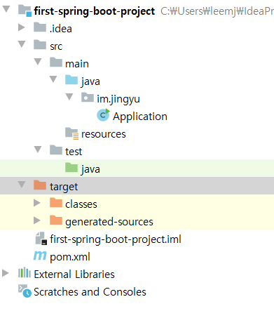

# 03. 스프링 부트 개념과 활용
## 섹션 0. 소개
* 학습 목표
  * 스프링 부트의 핵심 원리를 이해합니다.
  * 스프링 부트가 제공하는 주요 기능을 사용할 수 있습니다.
  * 스프링 부트를 사용하여 웹 애플리케이션을 개발할 수 있습니다.
  * 스프링 부트를 사용하여 여러 데이터 기술과 연동하는 애플리케이션을 개발할 수 있습니다.
  * 스프링 부트 애플리케이션의 운영 정보를 관리하고 모니터링 할 수 있습니다.

## 섹션 1. 스프링 부트 시작하기
### 스프링 부트 소개
* https://spring.io/projects/spring-boot

### 스프링 부트 시작하기
```xml
<? xml version = "1.0"encoding = "UTF-8"?> 
<project  xmlns = "http://maven.apache.org/POM/4.0.0"xmlns  : xsi = "http : //www.w3 .org / 2001 / XMLSchema-instance " 
	xsi : schemaLocation = "http://maven.apache.org/POM/4.0.0 http://maven.apache.org/xsd/maven-4.0.0.xsd " > 
	<modelVersion> 4.0.0 </ modelVersion>

	<groupId> com.example </ groupId> 
	<artifactId> myproject </ artifactId> 
	<version> 0.0.1-SNAPSHOT </ version>

	<!-Spring Boot에서 기본값 상속-> 
	<parent> 
		<groupId> org.springframework.boot </ groupId> 
		<artifactId> spring-boot-starter-parent </ artifactId> 
		<version> 2.0.3.RELEASE < / version> 
	</ parent>

	<!-웹 애플리케이션에 대한 일반적인 종속성 추가-> 
	<dependencies> 
		<dependency> 
			<groupId> org.springframework.boot </ groupId> 
			<artifactId> spring-boot-starter-web </ artifactId> 
		</ dependency> 
	</ dependencies>

	<!-실행 파일로 패키지-> 
	<build> 
		<plugins> 
			<plugin> 
				<groupId> org.springframework.boot </ groupId> 
				<artifactId> spring-boot-maven-plugin </ artifactId> 
			</ plugin > 
		</ plugins> 
	</ build>

</ project>
```

### 스프링 부트 프로젝트 생성기
* https://start.spring.io/

### 스프링 부트 프로젝트 구조
* 메인 애플리케이션 위치 : 기본 패키지만들고 그 밑에



## 섹션 2. 스프링 부트 원리
### 의존성 관리 이해
* 버전을 명시하지 않아도 알아서 가져온다. (pom.xml parent의 버전에 따라 필요한 버전을 알아서 넣어준다!)
* 내가 특별히 원하는 버전이 있거나 부트에서 관리하지 않는 의존성은 버전을 명시해줘야한다.
```xml
<!-- pom.xml -->
<parent>
	<groupId>org.springframework.boot</groupId>
        <artifactId>spring-boot-starter-parent</artifactId>
        <version>2.0.3.RELEASE</version>
</parent>

<!-- spring-boot-starter-parent-*.xml : Dependency management, UTF-8 source incoding, plugin configuration, resource filtering(.properties/.yml), ...-->
<parent>
        <groupId>org.springframework.boot</groupId>
        <artifactId>spring-boot-dependencies</artifactId>
        <version>2.0.3.RELEASE</version>
        <relativePath>../../spring-boot-dependencies</relativePath>
</parent>

<!-- spring-boot-dependencies-*.xml : 버전정보 있음 -->

```

### 의존성 관리 응용
* https://mvnrepository.com/ 참고
* 버전 관리 해주는 의존성 추가 : pom.xml - <dependencies> 에 추가 
* 버전 관리 안해주는 의존성 추가 : pom.xml - <dependencies> 에 추가 (버전 명시 필수)
* 기존 의존성 버전 변경하기 : pom.xml에 <properties> 에 버전 명시 (덮어쓰는 느낌)

### 자동 설정 이해
* @EnableAutoConfiguration (@SpringBootApplication 안에 숨어 있음)
* 빈은 사실 두 단계로 나눠서 읽힘
	* 1단계: @ComponentScan
	* 2단계: @EnableAutoConfiguration
* @ComponentScan - 해당 어노테이션을 달고있는 패키지 기준으로만 빈으로 등록
	* @Component
	* @Configuration @Repository @Service @Controller @RestController
* @EnableAutoConfiguration
	* spring.factories 파일에 들어있는 내용 모두 자동으로 빈 등록.(org.springframework.boot.autoconfigure.EnableAutoConfiguration)
	* 위에 등록된 애들은 @Configuration 어노테이션을 무조건 달고 있다.
	* but, 모든 애들이 빈으로 등록되는건 아니고, @ConditionalOnXxxYyyZzz 와 같이 조건에 맞을 때만 빈으로 자동 등록해준다.

### 자동 설정 만들기 1부: Starter와 AutoConfigure
* 커스텀한 자동설정 패키지 만들기
	* Xxx-Spring-Boot-Autoconfigure 모듈: 자동 설정
	* Xxx-Spring-Boot-Starter 모듈: 필요한 의존성 정의
	* 그냥 하나로 만들고 싶을 때는?
		* Xxx-Spring-Boot-Starter -> 해당이름으로 프로젝트 만들어서 pom.xml에 정의하여 사용(소스코드가 없는 프로젝트가 될 수도 있음)
* 구현 방법
	1. Configuration 프로젝트 생성
	2. 의존성 추가
	```xml
	<dependencies>
		<dependency>
			<groupId>org.springframework.boot</groupId>
			<artifactId>spring-boot-autoconfigure</artifactId>
		</dependency>
		<dependency>
			<groupId>org.springframework.boot</groupId>
			<artifactId>spring-boot-autoconfigure-processor</artifactId>
			<optional>true</optional>
		</dependency>
	</dependencies>
	<dependencyManagement>
		<dependencies>
			<dependency>
				<groupId>org.springframework.boot</groupId>
				<artifactId>spring-boot-dependencies</artifactId>
				<version>2.0.3.RELEASE</version>
				<type>pom</type>
				<scope>import</scope>
			</dependency>
		</dependencies>
	</dependencyManagement>
	```
	3. @Configuration 파일 작성
	4. src/main/resource/META-INF에 spring.factories 파일 만들기
	5. spring.factories 안에 자동 설정 파일 추가
	```
	org.springframework.boot.autoconfigure.EnableAutoConfiguration=\
	FQCN,\
	FQCN
	```
	6. mvn install
	7. ~SNAPSHOP.jar을 사용할 프로젝트에서 의존성추가
* 덮어쓰기 문제 : ComponentScan -> AutoConfiguration 이 수행되서 그렇다 (->다음강의)

### 자동 설정 만들기 2부: @ConfigurationProperties
* 덮어쓰기 방지하기 : @ConditionalOnMissingBean 어노테이션을 써주면 빈이 없을때만 수행한다.
* 빈 재정의 수고 덜기
	* Configuration 프로젝트
		* ~Propertiese 클래스에 @ConfigurationProperties(“holoman”)를 달아줌.
		* ~Configuration 빈에 @EnableConfigurationProperties(HolomanProperties.class)
	* Application 프로젝트 : application.properties에 정의
	* 의문??? : Configuration 프로젝트 Application 프로젝트의 application.properties 값을 어떻게 읽는거지? (밑에얘가 해주는건가..?)
	```xml
	<dependency>
		 <groupId>org.springframework.boot</groupId>
		 <artifactId>spring-boot-configuration-processor</artifactId>
		 <optional>true</optional>
	</dependency>
	```
* **@Conditional~ 어노테이션 찾아보기** 

### 내장 웹 서버 이해
* 스프링 부트는 서버가 아니다. 툴일 뿐이다. 내장된 톰캣을 사용하는 것! (서버는 톰캣,네트,제티,..)
	* 톰캣 객체 생성
	* 포트 설정
	* 톰캣에 컨텍스트 추가
	* 서블릿 만들기
	* 톰캣에 서블릿 추가
	* 컨텍스트에 서블릿 맵핑
	* 톰캣 실행 및 대기
* 이 모든 과정을 보다 상세히 또 유연하고 설정하고 실행해주는게 바로 스프링 부트의 자동 설정.
	* ServletWebServerFactoryAutoConfiguration (서블릿 웹 서버 생성)
		* TomcatServletWebServerFactoryCustomizer (서버 커스터마이징)
	* DispatcherServletAutoConfiguration
		* 서블릿 만들고 등록
* 의문??? : 부트쓰면 서버에 따로 톰캣이 없어도 되는..??

### 내장 웹 서버 응용 1부 : 컨테이너와 포트
* 다른 서블릿 컨테이너로 변경 (톰캣 -> ~) 
* 웹 서버 사용 하지 않기
	* properties에 `spring.main.web-application-type=none` 추가
* 포트
	* properties에 `server.port=7070`
	* 랜덤 포트 `server.port=0`
	* ApplicationListner<ServletWebServerInitializedEvent> 리스너 추가로 포트번호 꺼내기.. (필요할까?)
	
### 내장 웹 서버 응용 2부 : HTTPS와 HTTP2
* **https://opentutorials.org/course/228/4894 정주행+정리 하기**
* HTTPS 설정하기
	* 키스토어 만들기
	* HTTP는 못쓴다. HTTPS를 적용했기때문에 하나만 가능. 
		* 되게하려면? [HTTP 커넥터는 코딩으로 설정하기](https://github.com/spring-projects/spring-boot/tree/v2.0.3.RELEASE/spring-boot-samples/spring-boot-sample-tomcat-multi-connectors)
* HTTP2 설정 : server.http2.enable=true 
	* https가 설정이 되있어야 http2를 설정할 수 있음
	* 사용하는 서블릿 컨테이너 마다 다름.
		* Undertow : 별도 설정 필요 없음
		* 톰캣
			* 버전 8.5.x : 복잡하다... 하지마라!
			* 버전 9.0.x, JDK9 이상에서는 설정없이 사용가능

### 톰캣 HTTP2
* (위에 써놓은 내용)
* **HTTP2란??**

### 독립적으로 실행 가능한 JAR
* spring-boot-maven-plugin의 기능
* mvn clean package # clean : target 하위 디렉토리 결과물 삭제, package : jar 생성
* jar 결과물이 가진 의존성
	* 의존성인 jar들을 전부 가지고 있게 된다
	* target의 결과물을 까보면, app/BOOT-INFO/lib/ 하위에 의존성 jar들이 들어있다
	* spring boot는 의존성 jar를 그대로 읽을 수 있도록 org.springframework.boot.loader.jar.JarFile을 이용한다
	* 의존성 jar를 실행하는 것은 org.springframework.boot.loader.Launcher를 이용한다
	* (참고) 과거에는 uber jar를 이용했는데, jar를 읽을 수 없어서 각 jar들을 다 풀어서 사용했다고 한다

### 스프링 부트 원리 정리
* 의존성 관리
	* spring-boot-starter-web 은 parent를 이용하여 버전 관리 가능
* 자동 설정
* 내장 웹 서버
stand-alone application을 만드는 것이 spring boot의 목적, 내장 웹 서버 기능들이 들어있는 이유도 그 중 하나

## 섹션 3. 스프링 부트 활용
### 스프링 부트 활용 소개
* 스프링 부트 핵심 기능
	* SpringApplication
	* 외부 설정
	* 프로파일
	* 로깅
	* 테스트
	* Spring-Dev-Tools
* 각종 기술 연동
	* 스프링 웹 MVC
	* 스프링 데이터
	* 스프링 시큐리티
	* REST API 클라이언트
	* 다루지 않은 내용들

### SpringApplication
* SpringApplication.run(App.class, args) 로는 커스터마이즈 하기가 어렵다. 인스턴스를 직접 만들면 커스터마이즈 할 수 있다
* FailureAnalyzers : 에러에 대한 로깅을 포매팅해준 것, spring boot에 기본적으로 등록되어 있는 기능
* 배너
	* https://docs.spring.io/spring-boot/docs/current/reference/html/spring-boot-features.html#boot-features-banner
	* 커스터마이즈 방법
		* application 실행할 때 SPRING 큰 글자 모양을 보여주는 것인데, resources/banner.txt를 만들어서 텍스트를 변경 가능
			* ${spring-boot.version} : 버전 정보를 찍을 수 있다. 
			* banner.txt를 다른 위치에 두려면 application.properties에 spring.banner.location=classpath:... 로 가능
		* 코딩으로 하려면 아래와 같이 하자
		```java
		SpringApplication app = new SpringApplication(App.class);
		app.setBanner((env, soureClass, out) -> {
			out.println("==========");
			out.println("whiteship");
			out.println("==========");
		}
		app.run(args);
		```
		* banner.txt가 코딩으로 설정한 것보다 우선순위가 높다
* SpringApplicationBuilder
	* 빌더 패턴 제공
	* 이 방법도 커스터마이징 가능
	```java
	psvm() {
		new SpringApplicationBuilder()
			.source(App.class)
			.run(args);
	}
	```
* ApplicationEvent 등록
	* spring, spring boot 이벤트를 여러 가지 상황에서 제공 : 애플리케이션이 시작될 떄, application context를 만들었을 떄/ 리프레시 될 떄, 애플리케이션이 다 떠서 준비가 되었을 때/ 실패했을 때 등
	* 이벤트 리스너 만들기
	```java
	@Component // listener가 bean으로 등록되면 자동으로 리스너를 실행해 준다. 다만 ApplicationContext가 만들어지기도 전에 발생하는 이벤트는 직접 SpringApplication 인스턴스에 등록해야 한다
	public class SampleListener implements ApplicationListener<ApplicationStartingEvent> {
		@Override
		public void onApplicationEvent(ApplicationStartingEvent event) {
			sout("ApplicationStarting");
		}
	}
	```
	* 근데 위의 이벤트는 ApplicationContext가 만들어지기도 전에 발생하는 이벤트여서 리스너가 동작하지 않는다. 이런 경우에는 bean으로 생성하는 것으로는 자동으로 실행되지 않고 SpringApplication 인스턴스를 만들고, .addListeners(new SampleListener())로 등록해주어야 한다(빈으로 등록하는 것은 의미가 없다)
* WebApplicationType 설정
	* WebApplicationType은 NONE, SERVLET, REACTIVE 세 가지가 있다
	* Spring MVC가 있다면 SERVLET으로 동작
	* Spring Webflux가 있다면 REACTIVE로 동작
	* 둘 다 없다면 NONE
	* 둘 다 있다면 SERVLET이 우선순위가 높다. 그래서 REACTIVE를 쓰려면 직접 설정해주어야 한다
* application arguments 사용하기
	* application arguments : -- 옵션으로 들어오는 것 (intellij에서는 Program arguments)
	* vm option : -D 로 들어오는 것
	* application argument 찍어보기
	```java
	@Component
	public class AppArgs {
		public AppArgs(ApplicationArguments args) {
			sout("foo:" + args.containsOption("foo")); // vm option -D로 설정한 값이었고, false가 찍힘
			sout("bar:" + args.containeOption("bar")); // application arguments로 설정한 값이고, true가 찍힘
		}
	}
	```
* application이 실행된 뒤 추가로 어떤 작업이 필요할 때
	* ApplicationRunner (추천) 또는 CommandLineRunner
		* ApplicationRunner가 더 좋다
		```java
		@Component
		public class AppRunner implements ApplicationRunner {
			@Override
			public void run(ApplicationArguments args) {
				sout("foo:" + args.containsOption("foo"));
				sout("bar:" + args.containeOption("bar"));
			}
		}
		```
		* CommandLineRunner를 이용하면 메소드 구현의 인자가 String ...args로 들어와서 처리하기에 별로..
	* @Order()
		* ApplicationRunner를 여러 개 설정했다면 각 순서를 설정할 수 있다
		* 숫자가 적은 것이 우선순위가 높다
* (참고) 디버그 로그 레벨을 남기는 방법 : 실행 옵션에서 VM options에 -Ddebug를 주거나, Program arguments에 --debug를 사용하면 된다. 또한 디버그 레벨을 찍으면 자동 설정이 된 것들을 보여주고, 자동설정이 동작하지 않았다면 그 이유도 보여준다

### 외부 설정
* application.properties 는 spring에서 설정 파일로 사용하는 규약, key-value로 사용
* 우선순위 : https://docs.spring.io/spring-boot/docs/current/reference/html/spring-boot-features.html#boot-features-external-config
	* command line arguments : java -jar <jar-file-name> --<key>=<value> # 우선순위가 4순위라 application.properties(우선순위 15)를 오버라이팅 한다
	* test용 properties 설정하기
		* 방법 1
			* test/resources/application.properties에 설정
			* intellij의 command+;를 눌러서 Modules 탭에 TestResources 탭, TestResource Folders에 설정
			* 빌드 시 test code도 classpath에 들어가고 test/resources/application.properties가 main/resources/application.properties를 대체한다
			```java
			@RunWith(SpringRunner.class)
			@SpringBootTest
			public class ApplicationTests {
				@Autowired
				Environment env; // org.springframework.core.env.Environment
				@Test
				public void test() {
					assertThat(env.getProperty("keesun.name"))
							.isEqualTo("keesun"); // test/resoucres/application.properties의 설정파일을 사용
				}
			}
			```
			* 문제점 : main/resouces/application.properties를 덮어쓰기 때문에 main에만 설정하고 test에 설정하지 않았을 경우 main의 설정파일에 설정한 값이 사라지게 된다
		* 방법2
			* 우선순위 3
			* @SpringBootTest(properties = "keesun.name=keesun2")
		* 방법3
			* 우선순위 2
			* @TestPropertySource(properties = "keesun.name=keesun3") annotation을 test class 위에 작성
		* 방법1은 파일 자체를 덮어써서 main/resouces/application.properties의 설정값들이 사라지지만, 방법 2,3은 main/resouces/application.properties는 그대로 있고 새로 설정한 값만 덮어쓰게 되어 문제가 없다
		* 방법 2,3에서 프로퍼티가 너무 많다면
			* properties = {"key=value", "key2=value2"}
			* 파일로 관리
				* test/resources/test.properties 생성
				* key=value 들 작성
				* @TestPropertySource(location="classpath:/test/properties")로 변경
		* (참고) application.properties에서 랜덤값 생성하기
			* 우선순위 11에 해당하는 RandomValuePropertySouce 이다
			* ${random.int} ${random.int(1000,2000)} ${random.uuid} 등
		* (참고) commandline properties를 사용하지 못하게 하려면 SpringApplication.setAddCommandLineProperties(false);
* application.properties를 놓을 수 있는 위치와 우선순위
	* 숫자가 작은 값이 우선순위가 높다
		1. file:./config/ : project root/config/ 하위에 application.properties를 둠
		2. file:./ : project root 또는 jar파일의 실행 위치에 둠
		3. classpath:/config/ 에 둠
		4. classpath:/ 에 둠
	* 다만 테스트에서 @TestPropertySouce를 사용중이라면 이 application.properties의 위치에 따른 우선순위보다는 외부설정 우선순위를 따라가게 된다

* 타입-세이프 프로퍼티 @ConfigurationProperties
	```java
	@Component
	@ConfigurationProperties("keesun")
	public class KeesunProperties {
		private String name;
		private int age;
		private String fullName;
		//getter/setter
	}
	// (참고)이 때 intellij에서 "Spring Boot Configuration Annotation Processor not found in classpath" 라는 에러를 주는데 application.properties에서 intellij가 자동완성을 하기위한 메타데이터를 가져올 수 있는 플러그인을 넣어줘야 한다. (spring-boot-configuration-processor)
	// 원래는 @ConfigurationProperties 어노테이션을 처리할 수 있게끔 main class 위에 @EnableConfigurationProperties(KeesunProperties.class)를 등록해주어야 하는데 내장되어 있다
	// 사용하는 곳에서는 @Autowired KeesunProperties properties; 로 받아서 쓴다
	```
	* 여러 프로퍼티를 묶어서 읽어올 수 있음
	* (설정 파일의 값들을) 빈으로 등록해서 다른 빈에 주입할 수 있음
		* @EnableConfigurationProperties
		* @Component (주로 쓰는 방법)
		* @Bean
	* 융통성 있는 바인딩
		* https://docs.spring.io/spring-boot/docs/current/reference/html/spring-boot-features.html#boot-features-external-config-relaxed-binding
		* 아래와 같은 케이스들을 전부 바인딩해줌
			* context-path(케밥)
			* context_path(언더스코어)
			* contextPath(캐멀)
			* CONTEXTPATH
	* 프로퍼티 타입 컨버전
		* @DurationUnit
			* 시간 정보를 받을 때 사용
			```java
			// application.properties
			keesun.sessionTimeout = 25
			// KeesunProperties class
			@DurationUnit(ChronoUnit.SECONDS)
			private Duration sessionTimeout = Duration.ofSeconds(30); // set default 30 sec
			```
			* 그런데 25s를 사용하면 @DurationUnit annotation을 사용하지 않아도 된다
			```java
			keesun.sessionTime=25s
			private Duration sessionTimeout = Duration.ofSeconds(30);
			```
		* spring이 제공하는 conversion service를 이용하여 변환해 준다
		* ex. keesun.age = 100 // string
			private int age; // 자동으로 형 변환하여 integer로 주입
	* 프로퍼티 값 검증
		* @Validated
		* JSR-303 사용 가능 (@NotNull, ...)
		```java
		@Component
		@ConfigurationProperties("keesun")
		@Validated
		public class KeesunProperties {
			@NotEmpty
			private String name;
			@Size(min=0, max=100)
			private int age;
			...
		}
		```
	* (참고) Third-party Configuration : 이미 존재하는 설정을 빈으로 등록하여 사용하는 방법https://docs.spring.io/spring-boot/docs/current/reference/html/spring-boot-features.html#boot-features-external-config-3rd-party-configuration

### 프로파일
* @Profile annotation은 어디에?
	* @Configuration
	* @Component
* 어떤프로파일을 활성화 할 것인가
	* spring.profiles.active
		* 이 값도 역시 프로퍼티이고, 프로퍼티 우선순위 적용을 전부 받는다
* 어떤 프로파일을 추가할 것인가
	* spring.profiles.include
		* 추가할 프로파일을 지정
		* 만약 application-prod.properties에서 spring.profiles.include=proddb를 지정하면, application-proddb.properties 설정도 읽어들인다
* 프로파일용 프로퍼티
	* application-{profile}.properties
	* 기본적으로 application.properties가 application-{profile}.properties보다 우선순위가 낮아서 application-{profile}.properties에 설정한 값이 application.properties에 설정된 값들을 덮어쓴다

### 로깅
* 로깅 퍼사드 vs 로거
	* 로깅 퍼사드 : Commons Logging(spring boot에서 사용), SLF4j
		* 실제 로깅을 하는게 아니라 추상화 해둔 인터페이스
		* 프레임워크를 만들때는 주로 로깅 퍼사드를 사용하여 코딩
		* 일반 애플리케이션을 만드는 곳에서도 로깅 퍼사드를 사용해도 문제는 없다
		* 로깅 퍼사드를 사용하는 장점은 로거를 바꿔낄 수 있다
	* 로거 : JUL, Log4J2, Logback(spring boot가 사용)
* spring 5에 로거 관련 변경 사항
	* Spring-JCL
		* spring 5부터는 Spring-JCL가 개입하면서 spring boot가 최종적으로 Commons Logging -> SLF4j -> Logback으로 사용하게 된다
		* (참고) spring-boot-starter-logging 의존성에서 보면 log4j-to-slf4j, jul-to-slf4j라는 의존성이 들어있는데 이 의존성들이 java util 이나 log4j를 slf4j api로 보내도록 한다
		* pom.xml에 exclusion 안해도 됨
* 스프링 부트 로깅
	* reference : https://docs.spring.io/spring-boot/docs/current/reference/html/spring-boot-features.html#boot-features-logging
	* 기본 포맷 : 날짜/시간/log level/pid/method/full package/log
	* --debug (일부 핵심 라이브러리만 디버깅 모드로)
	* --trace (전부 다 디버깅 모드로)
	* 컬러 출력 : spring.output.ansi.enabled = always/detect/never
	* 파일 출력 : logging.file 또는 logging.path 를 선택하여 사용. 이 파일은 10MB마다 rotate됨
	* 로그 레벨 조정 : logging.level.<package> = <log level> // 로그 레벨을 패키지마다 설정 가능. 직접 만든 패키지가 아니고 외부에서 제공하는 패키지를 설정해도 된다
* 커스터마이징
	* 보통 업무에서 사용할 때는 사내 로깅 시스템에 연동을 해야해서 이런 방법을 사용할 수 있다
	* 커스텀 로그 설정 파일 사용하기
		* Logback : logback-spring.xml 파일 추가 (classpath에 추가해야 한다. 즉, resources/logback-spring.xml)// https://docs.spring.io/spring-boot/docs/current/reference/html/howto.html#howto-configure-logback-for-logging
		* Log4J2 : log4j2-spring.xml 파일 추가
		* JUL (비추) : logging.properties
		* Logback extension
			* 프로파일 <springProfile name="프로파일">
			* Environment property <springProperty> // environment를 로깅할 때.
	* 로거를 Log4j2로 변경하기
		* tomcat을 jetty로 바꾼 방식과 동일하게 exclusion을 사용하여 기존의 것(spring-boot-starter-logging)을 제거하고 다른 것(spring-boot-starter-log4j2)을 추가하면 된다
		* https://docs.spring.io/spring-boot/docs/current/reference/html/howto.html#howto-configure-log4j-for-logging

### 테스트
* 시작은 spring-boot-starter-test를 추가하는 것 부터
	* test scope로 의존성 추가
	* junit, json-path(json assertion), mockito(mockup) 등 테스트에 사용되는 의존성이 다 들어온다
* @SpringBootTest
	* @RunWith(SpringRunner.class)와 같이 써야 한다
	* @SpringBootApplication 을 찾아가서 모든 bean scan 후에 @MockBean만 찾아서 교체해준다. 
	* webEnvironment
		* MOCK : mock servlet environment, 내장 톰캣 구동하지 않음. Mocking DispatcherServlet을 사용하므로 MockMvc를 사용해야 한다.
		```java
		@RunWith(SpringRunner.class)
		@SpringBootTest(webEnvironment = SpringBootTest.WebEnvironment.MOCK) // servlet을 mocking한 DispatcherServlet이 뜬다
		@AutoConfigureMockMvc // 위의 Mock DispatcherServlet에 요청을 보내려면 MockMvc, MockMvcClient를 사용해야 한다. 이를 위해 이 어노테이션과 아래의 MockMvc를 사용하면 된다
		public class SampleControllerTest {
			@Autowired
			MockMvc mockMvc;
			@Test
			public void hello() throws Exception {
				mockMvc.perform(get("/hello"))
					.andExpect(status().isOk()) // 기대되는 결과값
					.andExpect(content().string("hello suhyeon")) // 기대되는 컨텐츠 내용
					.andDo(print());
				// 어떤 클래스의 어떤 메소드를 사용했는지 등등도 검사할 수 있다 
		}
		```
		* RANDOM_PORT, DEFINED_PORT : 내장 톰캣을 사용, test용 RestTemplate이나 test용 WebClient(for webflux)를 사용해야 한다
		```java
		@RunWith(SpringRunner.class)
		@SpringBootTest(webEnvironment = SpringBootTest.WebEnvironment.RANDOM_PORT) // 실제 내장 톰캣을 띄우고 거기에 요청을 보내어 테스트한다
		public class SampleControllerTest {
			@Autowired
			TestRestTemplate testRestTemplate;
			@MockBean
			SampleService mockSampleService; // ApplicationContext에 들어있는 빈SampleController.sampleService를 모킹하여 controller layer에서만 테스트를 진행할 수 있다
			@Test
			public void hello() {
				when(mockSampleService.getName()).thenReturn("sh"); // 결과값을 모킹한다
				String result = testRestTemplate.getForObject("/hello", String.class);
				assetThat(result).isEqualsTo("hello sh");
			}
		}
		```
		* NONE: 서블릿 환경 제공 안 함
* @MockBean
	* ApplicationContext에 들어있는 빈을 Mock으로 만든 객체로 교체함
	* 모든 @Test마다 자동으로 리셋
* WebClient
	* spring webflux (asynchronous) 를 이용할 때 사용. 비동기로 동작하여 응답이 오면 콜백으로 처리한다
	* spring-boot-starter-webflux 의존성 필요
	```java
	public class SampleControllerTest {
		@Autowired
		WebTestClient webTestClient;
		@MockBean
		SampleService mockSampleService;
		@Test
		public void hello() {
			when(mockSampleService.getName()).thenReturn("suhyeon");
			webTestClient.get().uri("/").exchange()
				.expectStatus().isOk()
				.expectBody(String.class).isEqualsTo("hello suhyeon");
	}
	```
* 슬라이스 테스트
	* SpringBootTest가 모든 빈을 찾아서 작업하므로 좀 더 간단하게 하려면 이 방법을 사용
	* 레이어 별로 잘라서 테스트하고 싶을 때
	* @JsonTest // 가지고있는 모델이 어떤 모양의 json으로 나가는지 확인하는 테스트, https://docs.spring.io/spring-boot/docs/current/reference/html/spring-boot-features.html#boot-features-testing-spring-boot-applications-testing-autoconfigured-json-tests
	* @WebMvcTest // controller 하나만 테스트하기
	```java
	@RunWith(SpringRunner.class)
	@WebMvcTest(SampleController.class) // web과 관련된 빈들만(@Controller 등) 빈으로 등록이 된다. (@Component 하위의 어노테이션들의 구분이 필요했던 이유라고 생각됨)
	public class Test {
		@MockBean
		SampleService sampleService; // @Service는 web과 관련된 빈이 아니라서 mock으로 등록해야한다
		@Autowired
		MockMvc mockMvc;
		...
	}
	```
	* @WebFluxTest
	* @DataJpaTest // @Repository 들만 빈으로 등록
...

### 테스트 유틸
* OutputCapture 
	* 가장 유용할 것
	* 로그를 비롯한 콘솔에 찍히는 모든 것을 캡쳐
	* 로그 메세지가 어떻게 찍혔는지 테스트 가능하다
	```java
	@RunWith(SpringRunner.class)
	public class Test {
		@Rule
		public OutputCapture outputCapture = new OutputCapture();
		@Test
		public void test() {
			...
			assertThat(outputCapture.toString())
				.contains("holoman") // logger의 내용
				.contains("skip");        // sout의 내용도 가능
		}
	}
	```
* TestPropertyValues
* TestRestTemplate
* ConfigFileApplicationContextInitializer

## 섹션 4. 스프링 부트 운영

## 섹션 5. 마무리

---
