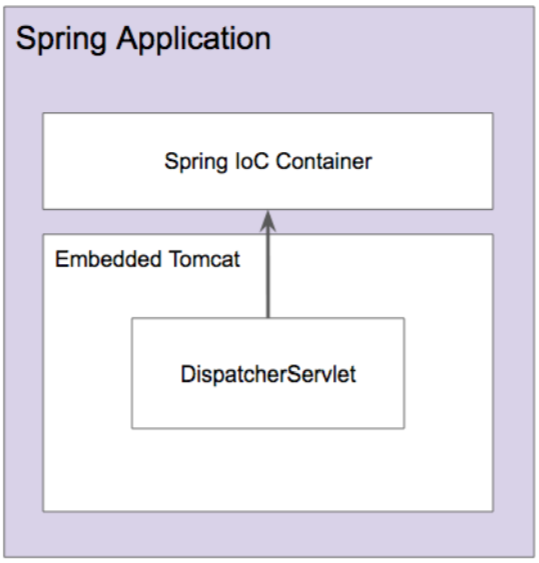
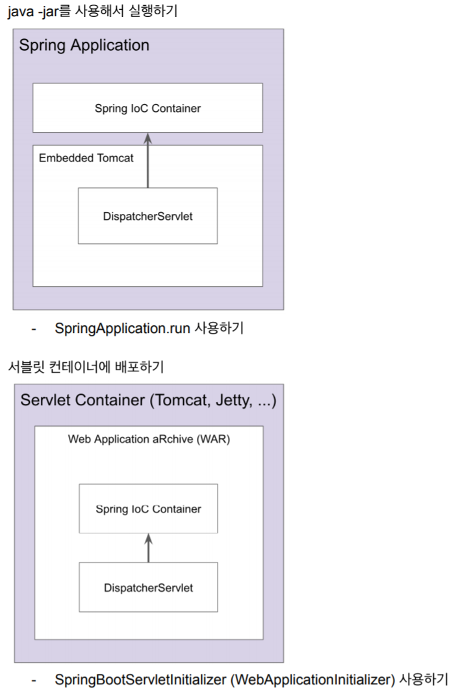

# 04. 스프링 웹 MVC
## 섹션 0. 소개
## 섹션 1. 스프링 MVC 동작 원리
### 스프링 MVC 소개
* Model
    * POJO
    * Domain Object 또는 Data Transfer Object로 화면에 전달하거나 화면에서 전달 받은 데이터를 담고있는 객체
* View
    * HTML, JSP, thymeleaf, ...
    * 데이터를 보여주는 역할. 다양한 형태로 보여줄 수 있다. HTML,JSON,XML 등
* Controller
    * spring @MVC
    * 사용자 입력을 받아 모델 객체의 데이터를 변경하거나, 모델 객체를 뷰에 전달하는 역할
        * 입력값 검증
        * 입력 받은 데이터로 모델 객체 변경
        * 변경된 모델 객체를 뷰에 전달
* MVC 패턴의 장점
    * 동시 다발적(Simultaneous) 개발 - 백엔드 개발자와 프론트엔드 개발자가 독립적으로 개발을 진행 할 수 있다
    * 높은 결합도 : 논리적으로 관련있는 기능을 하나의 컨트롤러로 묶거나 특정 모델과 관련있는 뷰를 그룹화 가능
    * 낮은 의존도 : 뷰, 모델, 컨트롤러는 각각 독립적 (예 : view는 HTML, JSON, XML 등으로 보여주지만 controller에서는 변화가 없어도 된다)
    * 개발 용이성 : 책임이 구분되어있어 코드 수정이 용이
    * 한 모델에 대한 여러 형태의 뷰를 가질 수 있다
* MVC 패턴의 단점
    * 코드 네비게이션 복잡함 (서비스 로직을 순서대로 따라가려면 내부 구현을 알고있어야 한다)
    * 코드 일관성 유지에 노력이 필요
    * 높은 학습 곡선
* code
```java
@Controller
public class EventController {
    @Autowired
    EventService eventService;
    @GetMapping("/events")
    public String events(Model model) {
        // Model == Map
        model.addAttribute("events", eventService.getEvnets());
        return "events";
    }
}

// Create model, POJO
@Getter @Setter
@Builder @NoArgsConsturctor @AllArgsConstructor
public class Event {
    private String name;
    private limitOfEnrollment;
    private LocalDateTime startDateTime;
    private LocalDateTime endDateTime;
}

// EventService
@Service
public class EventService {
    public List<Event> getEvents() {
        Event event = Event.builder()
            .name("Spring web MVC study")
            .limitOfEnrollment(5)
            .startDateTime(LocalDateTime.of(2019,1,10,12,0)
            .endDateTime(LocalDateTime.of(2019,1,1612,0)
            .build();
        return List.of(event);
}
```

```html
<!--resources/templates/events.html-->
<!DOCTYPE html>
<html lang="en" xmlns:th="http://www.thymeleaf.org">
<head>
    <meta charset="UTF-8">
    <title>Title</title>
</head>
<body>
    <h1>Event list</h1>
    <table>
        <tr>
            <th>name</th>
            <th>number of participaints</th>
            <th>start</th>
            <th>end</th>
        </tr>
        <tr th:each="event: ${events}">
            <td th:text="${event.name}">event name</td>
            <td th:text="${event.limitOfEnrollment}">100</td>
            <td th:text="${event.startDateTime}">2020.01.10</td>
            <td th:text="${event.endDateTime}">2020.01.10</td>
        </tr>
    </table>
</body>
</html>
```
 
### 서블릿 소개
* 서블릿(Servlet)
    * 자바 엔터프라이즈 에디션은 웹 애플리케이션 개발용 스펙과 API를 제공
    * 요청 당 쓰레드(만들거나, 풀에서 가져다가) 사용
    * 그 중에 가장 중요한 클래스 중 하나가 HttpServlet
* 서블릿 등장 이전에 사용하던 기술인 CGI (Common Gateway Interface)
    * 요청 당 프로세스를 만들어 사용
* 서블릿의 장점(CGI)
    * 빠르다
    * 플랫폼(OS) 독립적
    * 보안
    * 이식성
* 서블릿 엔진 또는 서블릿 컨테이너 (톰캣, 제티, 언더토우, ..)
    * servlet의 스펙에 따라 구현한 컨테이너. servlet을 어떻게 초기화하고 실행하는지, 서블릿의 라이프 사이클을 관리할 줄 알고 있음
    * 세션 관리
    * 네트워크 서비스
    * MIME 기반 메세지 인코딩 디코딩
    * 서블릿 생명주기 관리
    * ...
    * servlet application은 우리가 실행할 수 있는게 아니라 servlet container가 실행해 주기 때문에 servlet container를 이용해야 한다
* 서블릿 생명주기
    * 서블릿 컨테이너가 서블릿 인스턴스의 init() 메서드를 호출하여 초기화
        * 최초 요청을 받았을 때 한번 초기화 하고 나면 그 다음 요청부터는 이 과정을 생략
    * 서블릿 초기화 된 다음부터 클라이언트 요청을 처리 가능, 각 요청은 별도의 쓰레드로 처리하고 이 때 서블릿 인스턴스의 service() 메서드를 호출
        * 이 안에서 HTTP요청을 받고 클라이언트로 보낼 HTTP 응답을 만든다
        * service()는 보통 HTTP Method에 따라 doGet(), doPost() 등으로 처리를 위임
        * 따라서 보통 doGet() 또는 doPost()를 구현한다
    * 서블릿 컨테이너 판단에 따라 해당 서블릿은 메모리에서 내려야 할 시점에 destroy()를 호출
 
### 서블릿 애플리케이션 개발
* 실제로 servlet을 개발할 일은 잘 없고 레거시 프로젝트에 들어가야한다면 필요할 듯
* HttpServlet을 상속받는 HelloServlet을 만들고, init(), doGet(), destroy()를 구현한다. 그리고 servlet container(tomcat)를 달아주어 구현한 HelloServlet이 호출될 수 있도록 한다
* application이 뜬 후 처음으로 해당 url에 요청이 들어오면 그제서야 init, doGet이 호출이되는 것을 보여주었고, 이후에 동일한 url로 요청이 오면 doGet만 호출이 된다. servlet container를 종료할 때 destroy가 호출된다.
 
### 서블릿 리스너와 필터
* servlet listener
    * 웹 애플리케이션에서 발생하는 주요 이벤트를 감지하고 각 이벤트에 특별한 작업이 필요한 경우에 사용할 수 있다
        * 서블릿 컨텍스트 수준의 이벤트
            * 컨텍스트 라이프사이클 이벤트
            * 컨텍스트 애트리뷰트 변경 이벤트
        * 세션 수준의 이벤트
            * 세션 라이프사이클 이벤트
            * 세션 애트리뷰트 변경 이벤트
        * 위의 4가지 이벤트들에 상응하는 리스너를 만들기 위한 방법은 각각 다르다
    * 예시 : 서블릿 컨테이너가 구동될 때 db connection을 맺어놓고, servlet application이 만들어둔 여러 servlet에 제공해 줄 수 있고, 서블릿 컨테이너가 종료될 때의 이벤트에서 db connection을 닫아줄 수 있다
* 서블릿 필터
    * 들어온 요청을 서블릿으로 보낼 때, 또는 서블릿이 작성한 응답을 클라이언트로 보내기 전에 특별한 처리가 필요한 경우에 사용할 수 있다
    * url pattern이나 특정 servlet에 적용 가능하다
    * 체인 형태의 구조 (web.xml에 작성한 순서대로(아래의 A->B) filter가 적용된다.)

* listener code
```java
public class MyListener implements ServletContextListener {
    @Override
    public void contextInitialized(ServletContextEvent sce) {
        sout("context initialized");
        sce.getServletContext().setAttribute("name", "suhyeon");
    }
    @Override
    public void contextDestroyed(ServletCOntextEvent sce) {
        sout("context destroyed");
    }
}

```
```html
<!--web.xml-->
<web-app>
    <listener>
        <listener-class>com.suhyeon.MyListener</listener-class>
    </listener>
</web-app>
```

* context가 먼저 초기화 되고나서 servlet의 init, doGet이 호출되고, 서블릿 컨테이너를 종료하면 서블릿의 destroy가 호출된 뒤 context destroyed가 호출된다
* filter code
```java
import javax.servlet.*;
public class MyFilter implements Filter {
    @Override
    public void init(FilterConfig filterConfig) throws ServletException {
        sout("Filter Init");
    }
    @Override
    public void doFilter(ServletRequest request, ServletResponse response FilterChain chain) {
        sout("Filter");
        // 아래 코드가 없이는 다음 filter로 연결이 되지 않는다
        chain.doFilter(request, response);
    }
    @Override
    public void destroy() {
        sout("Filter Destroy");
    }
}
```
```html
<!--web.xml-->
<web-app>
    <filter>
        <filter-name>myFilter</filter-name>
        <filter-class>com.suhyeon.MyFilter</filter-class>
    </filter>
    <filter-mapping>
        <filter-name>myFilter</filter-name>
        <servlet-name>hello</servlet-name>
    </filter-mapping>
</web-app>
```
* 서블릿 컨테이너 실행 및 요청 시 : context init -> filter init -> (api call) -> servlet init -> filter -> doGet
* 서블릿 컨테이너 종료 시 : servlet destroy -> filter destroy -> context destroy
 
### 스프링 IoC 컨테이너 연동
* 서블릿 애플리케이션에 스프링 연동하기
    * 서블릿에서 스프링이 제공하는 IoC 컨테이너 활용하는 방법
        * 의존성 추가 : spring-webmvc
        * code
```html
<web-app>
    <!--spring IoC container를 사용하기 위한 리스너 등록-->
    <listener>
        <listener-class>org.springframework.web.context.ContextLoaderListener</listener-class>
    </listener>
    <!--ContextLoaderListener가 contextClass인 AnnotationConfigWebApplicationContext를 contextConfigLocation 정보를 이용하여 만든다-->
    <context-param>
        <param-name>contextClass</param-name>
        <param-value>org.springframework.web.context.support.AnnotationConfigWebApplicationContext</param-value>
    </context-param>
    <context-param>
        <param-name>contextConfigLocation</param-name>
        <param-value>com.suhyeon.AppConfig</param-value>
    </context-param>
</web-app>
```
* 이와 같이 설정하면, ContextLoaderListener가 Spring IoC container (ApplicationContext)를 <context-param>을 이용하여 만들어 주고, 생성된 bean들을 이제 servlet에서 사용할 수 있게 된다.
* 만들어지는 위치는 servletContext이며, 사용하려면 아래와 같다
```java
ApplicationContext context = (ApplicationContext) getServletContext().getAttribute(WebApplicationContext.ROOT_WEB_APPLICATION_CONTEXT_ATTRIBUTE);
HelloService helloService = context.getBean(HelloService.class);
```
* ContextLoaderListener는 servlet listener로 등록이 되는데, servlet listener의 역할이 servlet context lifecycle 단위로 실행 가능하므로 bean을 ContextLoaderListener가 ApplicationContext를 만들 수 있다
* 스프링이 제공하는 서블릿 구현체 DispatcherServlet 사용하기
* DispatcherServlet
    * 스프링 MVC의 핵심
    * Front Controller 역할
        * 모든 요청을 하나의 controller가 받고, 적절한 handler에 분배(dispatch)하는 방식
        * Front Controller 역할을 하는 서블릿을 spring에서 구현해 두었는데, 이게 DispatcherServlet이다
    * DispatcherServlet은 Root WebApplicationContext를 상속받아서 내부에서 사용할 Servlet WebApplicationContext를 만든다. Root WebApplicationContext의 빈들은 Service, Respository들만 있는데, 이유는 각각의 Servlet WebApplicationContext에서 공통으로 사용하는 빈들이 Service, Repository들이고 웹과 관련된 빈들은 여러 DispatcherServlet에서 그안의 스코프에서 사용할 설정들을 두게 한다
 
### 스프링 MVC 연동
* 위에서 했던 방식은, servlet 에 Spring IoC container를 연동해 보았고, 이제는 spring MVC를 연동해 본다
* ApplicationContext를 아래와 같이 구분하여 만들어야 한다. DispatcherServlet이 여러 개일 경우 이렇게 해야하는데, 이런 경우는 거의 없다. 대부분 하나의 DispatcherServlet을 이용하는 구조다
```java
@Configuration
@ComponentScan(useDefaultFilters = false, excludeFilters = @ComponentScan.Filter(Controller.class))
public class AppConfig {
    // app 관련된 설정(모든 서블릿에서 사용할)은 Root WebApplicationContext에 빈으로 등록되어야 함
}
@Configuration
@ComponentScan(useDefaultFilters = false, includeFilters = @ComponentScan.Filter(Controller.class))
public class WebConfig {
    // web 관련된 설정은 DistpatcherServlet 내부에서 사용하는 빈에 등록이 되어야 함
}
```
* 반드시 부모/자식 관계의 WebApplicationContext를 만들지 않고 하나의 DispatcherServlet에 모든 빈을 등록하고 사용해도 된다. (DispatcherServlet을 하나만 사용할 경우)
```html
<web-app>
    <servlet>
        <servlet-name>app</servlet-name>
        <servlet-class>org.springframework.web.servlet.DispatcherServlet</servlet-class>
        <init-param>
            <param-name>contextClass</param-name>
            <param-value>org.springframework.web.context.support.AnnotationContextWebApplicationContext</param-value>
        </init-param>
        <init-param>
            <param-name>contextConfigLocation</param-name>
            <param-value>com.suhyeon.WebConfig</param-value>
        </init-param>
    </servlet>
    <servlet-mapping>
        <servlet-name>app</servlet-name>
        <url-pattern>/app/*</url-pattern>
    </servlet-mapping>
</web-app>
```
* spring은 servlet container(tomcat)안에 java 코드를 넣은 반면, spring boot는 boot인 java 코드에 내장으로 tomcat을 넣어두었다
 
### DispatvcherServlet
* 어떻게 해야 annotation기반으로 handler를 사용할 수 있는지 알아봄
* DispatcherServlet 초기화
    * 다음의 특별한 타입의 빈들을 찾거나 기본 전력에 해당하는 빈들을 등록
        * HandlerMapping : 핸들러를 찾아주는 인터페이스
        * HandlerAdapter : 핸들러를 실행하는 인터페이스
        * HandlerExceptionResolver
        * ViewResolver
        * ...
    * DispatcherServlet 동작 순서 (DispatcherServlet.doDispatch method를 보고 설명)
        * 요청 분석 (로케일, 테마, 멀티파트 등)
        * (핸들러 매핑에게 위임하여) 요청한 핸들러를 찾는다
            * default로 가지는 핸들러 매핑은 BeanNameUrlHandlerMapping(org.springframework.web.servlet.mvc.Controller interface를 구현한 Controller를 처리), RequestMappingHandlerMapping(annotation기반 spring MVC handler를 처리)
        * (등록되어 있는 핸들러 어댑터 중에) 해당 핸들러를 실행할 수 있는 "핸들러 어댑터"를 찾는다
            * SimpleControllerHandlerAdapter : Controller interface를 구현하여 만든 Controller를 처리할 수 있다
        * 찾아낸 "핸들러 어댑터"를 사용하여 핸들러의 응답을 처리한다
            * 핸들러의 리턴값을 보고 어떻게 처리할지 판단한다
                * ModelAndView 객체가 null이 아닌 경우, 뷰 이름에 해당하는 뷰를 찾아가서 모델 데이터를 렌더링한다
                * ModelAndView 객체가 null인 경우, @ResponseEntity가 있다면 Converter를 사용하여 응답 본문을 만든다
                * (참고) 리턴값의 타입에 따라 핸들러가 몇 가지 존재한다. @ResponseBody를 처리하기 위한 핸들러도 있다 
        * (부가적으로) 예외 발생 시 예외처리 핸들러에 요청 처리를 위임한다
        * 최종적으로 응답을 보낸다
    *  예제 1 : RestController로 하나의 endpoint를 둔다
        * 위의 2번에서 기본 핸들러 매핑인 RequestMappingHandlerMapping을 이용하게 된다
        * 위의 4번에서 두 번째의 경우(converter를 이용하여 응답 본문을 만듦. model and view가 null이다)에 해당한다
    * RequestMappingHandlerMapping example
        * code
            ```java
            @Controller
            public class HelloController {
                @Autowired
                HelloService helloService;
                @GetMapping("/hello")
                @ResponseBody
                public String hello() { return "hello"; }
                @GetMapping("/sample")
                public String sample() { return "/WEB-INF/sample.jsp"; }
            }
            ```
* /hello는 동작 순서 2번에서 RequestMappingHandlerMapping 핸들러를 사용, 4번에서는 @ResponseBody 애노테이션 때문에 ModelAndView객체가 null이므로 바로 string을 응답 본문으로 내려준다.
* /sample은 동작 순서 2번에서 마찬가지로 RequestMappingHandlerMapping 핸들러를 사용(디버깅 중에는 selectHandler method 안에서 리턴되는 handler가 실제로는 ViewNameMethodReturnValueHandler던데?), 4번에서는 ModelAndView객체가 생성이 되어서 /WEB-INF/sample.jsp를 렌더링한다

* BeanNameUrlHandlerMapping example
    * code
        ```java
        @org.springframework.stereotype.Controller("/simple")
        public class SimpleController implements Controller {
            @Override
            public ModelAndView handleRequest(HttpServletRequest request, HttpServletResponse response) {
                return new ModelAndView("/WEB-INF/simple.jsp");
            }
        }
        ```
* 동작 방식 2번에서 BeanNameUrlHandlerMapping을 핸들러로 사용하고, 4번에서는 역시 ModelAndView객체가 있으므로 /WEB-INF/simple.jsp를 렌더링한다
* 참고) @RestController는 각 controller method에 @ResponseBody 애노테이션을 단 것과 동일하다.
* 참고) DispatcherServlet은 init과정을 거치는데, 여기서 각 HandlerMapping, HandlerAdapter 등을 기본 설정에 따라 빈으로 등록한다. 이 등록되는 빈을 변경할 수 있는 예제를 보여준다 (ViewResolver를 빈으로 등록하면서 기본 설정을 하는 코드)
 
### 스프링 MVC 구성 요소
* DispatcherServlet이 사용하는 interface를 살펴본다. DispatcherServlet이 초기화 될 때 아래 인터페이스들도 초기화 된다

* DispatcherServlet의 기본 전략
    * DispatcherServlet.properties file에 기록되어 있다
* MultipartResolver
    * 파일 업로드 요청 처리에 필요한 인터페이스
    * HttpServletRequest를 MultipartHttpServletRequest로 변환해주어 요청이 담고있는 File을 꺼낼 수 있는 API 제공
* LocaleResolver
    * 클라이언트의 위치 정보를 파악하는 인터페이스
    * 기본 전략(AcceptHeaderLocaleResolver)은 요청의 accept-language를 보고 판단
* ThemeResolver
    * 애플리케이션 설정된 테마를 파악하고 변경할 수 있는 인터페이스
    * 예시 : 클릭 한번에 웹페이지의 테마(css)가 변경되는 것
* HandlerMappings
    * 요청을 처리할 핸들러를 찾는 인터페이스
* HandlerAdapters
    * HandlerMapping이 찾아낸 핸들러를 처리하는 인터페이스
    * 스프링 MVC 확장력의 핵심
    * Handler를 커스터마이징 가능하다. HandlerMapping, HandlerAdapter를 구현하면 된다
* HandlerExceptionResolvers
    * 요청 처리 중에 발생한 에러를 처리하는 인터페이스
* RequestToViewNameTranslator
    * 핸들러에서 뷰 이름을 명시적으로 리턴하지 않은 경우, 요청을 기반으로 뷰 이름을 판단하는 인터페이스
    * Controller단에서 특정 View를 찾도록 그 이름을 리턴해주어야 하는데, 이 방법을 사용하면 view 이름을 가지고 실제 view를 찾아준다
* ViewResolvers
    * 뷰 이름(string)에 해당하는 뷰를 찾아내는 인터페이스
* FlashMapManager
    * FlashMap 인스턴스를 가져오고 저장하는 인터페이스
    * FlashMap은 주로 리다이렉션을 사용할 때 매개변수를 사용하지 않고 데이터를 전달하고 정리할 때 사용
    * 참고) 리다이렉션을 하는 이유는 파일 업로드와 같은 상황에서 브라우저를 리로드하면 또다시 파일 업로드 요청이 들어와버리므로, 업로드 요청 처리 후 get으로 리다이렉트 시켜서 form submission이 중복되지 않도록 한다

### 스프링 MVC 동작원리 정리
* 결국엔 (굉장히 복잡한) 서블릿.
    = DispatcherServlet
* DispatcherServlet 초기화
    1. 특정 타입에 해당하는 빈을 찾는다.
    2. 없으면 기본 전략을 사용한다. (DispatcherServlet.properties)
* 스프링 부트 사용하지 않는 스프링 MVC
    * 서블릿 컨네이너(ex, 톰캣)에 등록한 웹 애플리케이션(WAR)에 DispatcherServlet을 등록한다.
        * web.xml에 서블릿 등록
        * 또는 WebApplicationInitializer에 자바 코드로 서블릿 등록 (스프링 3.1+, 서블릿 3.0+)
    * 세부 구성 요소는 빈 설정하기 나름.
* 스프링 부트를 사용하는 스프링 MVC
    * 자바 애플리케이션에 내장 톰캣을 만들고 그 안에 DispatcherServlet을 등록한다.
        * 스프링 부트 자동 설정이 자동으로 해줌.
    * 스프링 부트의 주관에 따라 여러 인터페이스 구현체를 빈으로 등록한다.
    
## 섹션 2. 스프링 MVC 설정
### 스프링 MVC 구성 요소 직접 빈으로 등록하기
@Configuration을 사용한 자바 설정 파일에 직접 @Bean을 사용해서 등록하기
```java
@Configuration
@ComponentScan
public class WebConfig {

    @Bean
    public HandlerMapping handlerMapping() {
        RequestMappingHandlerMapping handlerMapping = new RequestMappingHandlerMapping();
        handlerMapping.setInterceptors();
        handlerMapping.setOrder(Ordered.HIGHEST_PRECEDENCE);
        return handlerMapping;
    }

    @Bean
    public HandlerAdapter handlerAdapter() {
        RequestMappingHandlerAdapter handlerAdapter = new RequestMappingHandlerAdapter();
        handlerAdapter.setArgumentResolvers(~);
        handlerAdapter.setMessageConverters(~);
        return handlerAdapter;
    }
}
```
-> 이렇게 설정하는 것은 상당히 low한 방법.. 쓸일 없을껄?ㅎ <br/>
-> 요렇게 설정하면, 설정한건 여기꺼 쓰이고, 설정하지 않은건 DispatcherServlet의 기본 설정을 따른다.

### @EnableWebMvc
애노테이션 기반 스프링 MVC를 사용할 때 편리한 웹 MVC 기본 설정
```java
@Configuration
@ComponentScan
@EnableWebMvc
public class WebConfig {
    
}
```
-> @EnableWebMvc > DelegatingWebMvcConfiguration > WebMvcConfigurationSupport 에 빈 설정이 되어 있다. <br/>
-> 기본 interceptor, 의미있는 우선순위(order), 더 많은 컨버터 .. 등이 추가로 설정되어 있음. 더 좋다. 
-> Delegate : 하나의 객체가 다른 객체를 대신해서 동작 또는 조정할 수 있는 기능을 제공

### WebMvcConfigurer 인터페이스
@EnableWebMvc가 제공하는 빈을 커스터마이징할 수 있는 기능을 제공하는 인터페이스
```java
@Configuration
@EnableWebMvc
public class WebConfig implements WebMvcConfigurer {
    @Override
    public void configureViewResolvers(ViewResolverRegistry registry) {
        registry.jsp("/WEB-INF/", ".jsp");
    }
}
```
-> WebMvcConfigurer를 상속받아 사용가능. (스프링 3.1부터)
-> 지금까지 이게 부트 없이 사용하는 방법. 이후에 부트사용해서..
-> 스프링에서 제공하는지 부트에서 제공하는지 경계를 알고 사용하는게 도움이 된다...ㅎ

### 스프링 부트의 스프링 MVC 설정

* 스프링 부트의 “주관”이 적용된 자동 설정이 동작한다.
    * JSP 보다 Thymeleaf 선호
    * JSON 지원
    * 정적 리소스 지원 (+ 웰컴 페이지, 파비콘 등 지원)
* 스프링 MVC 커스터마이징
    * application.properties < 요 방식이 요즘 주로 사용하는 방식!
    * @Configuration + Implements WebMvcConfigurer: 스프링 부트의 스프링 MVC 자동설정 + 추가 설정
    * @Configuration + @EnableWebMvc + Imlements WebMvcConfigurer : 스프링 부트의스프링 MVC 자동설정 사용하지 않음.

-> EnableAutoConfiguration에 기술되어 있는 모든 자동설정들이 자동으로 등록된다. (부트 수업에 있었던 내용) <br/>
-> 자동설정된 내용을 기반으로 `application.properties`에 prefix만 맞춰서 설정해주면 커스터마이징해서 사용 가능!
 
### 스프링 부트에서 JSP 사용하기
```
“If possible, JSPs should be avoided. There are several known limitations when using them with embedded servlet containers.” 
```
* 제약 사항
    * JAR 프로젝트로 만들 수 없음, WAR 프로젝트로 만들어야 함
    * Java -JAR로 실행할 수는 있지만 “실행가능한 JAR 파일”은 지원하지 않음
    * 언더토우(JBoss에서 만든 서블릿 컨테이너)는 JSP를 지원하지 않음
    * Whitelabel 에러 페이지를 error.jsp로 오버라이딩 할 수 없음.

* 의존성 추가
```xml
<dependency>
    <groupId>javax.servlet</groupId>
    <artifactId>jstl</artifactId>
</dependency>
<dependency>
    <groupId>org.apache.tomcat.embed</groupId>
    <artifactId>tomcat-embed-jasper</artifactId>
    <scope>provided</scope>
</dependency>
```
* 태그 선언
```html
<%@ taglib prefix="c" uri="http://java.sun.com/jsp/jstl/core"%>
```
* application.properties
```text
spring.mvc.view.prefix=/WEB-INF/jsp
spring.mvc.view.suffix=.jsp=
```

-> JAR/WAR 찾아보기 / maven... 프로젝트 빌드/배포 과정 살펴보기 - pom.xml에 core는 jar고, 나머지는 war...(with kksshh525)
-> 로컬에서 띄울때는 war exploded (war랑 차이?)

### WAR 파일 배포하기


### WebMvcConfigurer 1부 Formatter 추가하기
```java
@GetMapping("/hello/{name}")
public String hello(@PathVariable("name") Person person) {
    return "hello " + person.getName();
}
```
* Formatter
    * Printer: 해당 객체를 (Locale 정보를 참고하여) 문자열로 어떻게 출력할 것인가
    * Parser: 어떤 문자열을 (Locale 정보를 참고하여) 객체로 어떻게 변환할 것인가

* 포매터 추가하는 방법 1
    * WebMvcConfigurer의 addFormatters(FormatterRegistry) 메소드 정의
    ```java
    @Configuration
    public class WebConfig implements WebMvcConfigurer {
    
        @Override
        public void addFormatters(FormatterRegistry registry) {
            registry.addFormatter(new PersonFomatter());
        }
    }
    ```
* 포매터 추가하는 방법 2 (스프링 부트 사용시에만 가능 함)
    * 1번의 재정의 필요없고, 해당 포매터를 빈으로 등록만 해주면 됨
    ```java
    @Component
    public class PersonFomatter implements Formatter<Person> {
        @Override
        public Person parse(String s, Locale locale) throws ParseException {
            Person person = new Person();
            person.setName(s);
            return person;
        }
    
        @Override
        public String print(Person person, Locale locale) {
            return person.toString();
        }
    }
    ```

### 도메인 클래스 컨버터 자동 등록
* 스프링 데이터 JPA는 스프링 MVC용 도메인 클래스 컨버터를 제공합니다.
* 도메인 클래스 컨버터
    * 스프링 데이터 JPA가 제공하는 Repository를 사용해서 ID에 해당하는 엔티티를 읽어옵니다.
* 의존성 설정
```xml
<dependency>
    <groupId>org.springframework.boot</groupId>
    <artifactId>spring-boot-starter-data-jpa</artifactId>
</dependency>
<dependency>
    <groupId>com.h2database</groupId>
    <artifactId>h2</artifactId>
</dependency>
```
* 엔티티 맵핑
```java
@Entity
@Getter @Setter
public class Person {
    @Id @GeneratedValue
    private Long id;
    private String name;
}
```
* 레파지토리 추가
```java
public interface PersonRepository extends JpaRepository<Person, Long> {
}
```
* Controller
```java
@RestController
public class SampleController {

    @GetMapping("/hello")
    public String hello(@RequestParam("id") Person person) {
        return "hello " + person.getName();
    }
}
```
* 테스트 코드 수정
    * 테스트용 이벤트 객체 생성
    * 이벤트 리파지토리에 저장
    * 저장한 이벤트의 ID로 조회 시도
```java
@RunWith(SpringRunner.class)
@SpringBootTest
@AutoConfigureMockMvc
public class SampleControllerTest {

    @Autowired
    MockMvc mockMvc;

    @Autowired
    PersonRepository personRepository;

    @Test
    public void helloTest() throws Exception {
        Person person = new Person();
        person.setName("jingyu");
        Person savePerson = personRepository.save(person);
        
        this.mockMvc.perform(get("/hello")
                    .param("id", savePerson.getId().toString()))
                .andDo(print())
                .andExpect(content().string("hello jingyu"));
    }
}
```

### 핸들러 인터셉터 1부: 개념
* HandlerInterceptor
    * 핸들러 맵핑에 설정할 수 있는 인터셉터
    * 핸들러를 실행하기 전, 후(아직 랜더링 전) 그리고 완료(랜더링까지 끝난 이후) 시점에 부가 작업을 하고 싶은 경우에 사용할 수 있다.
    * 여러 핸들러에서 반복적으로 사용하는 코드를 줄이고 싶을 때 사용할 수 있다.
        * 로깅, 인증 체크, Locale 변경 등...
    ```
    //preHandle1
    //preHandle2
    //요청 처리
    // postHandle2
    // postHandle1
    // 뷰 랜더링
    // afterCompletion2
    // afterCompletion1
    ```
* boolean preHandle(request, response, handler)
    * 핸들러 실행하기 전에 호출 됨
    * “핸들러"에 대한 정보를 사용할 수 있기 때문에 서블릿 필터에 비해 보다 세밀한 로직을 구현할 수 있다.
    * 리턴값으로 계속 다음 인터셉터 또는 핸들러로 요청,응답을 전달할지(true) 응답 처리가 이곳에서 끝났는지(false) 알린다.
* void postHandle(request, response, modelAndView)
    * 핸들러 실행이 끝나고 아직 뷰를 랜더링 하기 이전에 호출 됨
    * “뷰"에 전달할 추가적이거나 여러 핸들러에 공통적인 모델 정보를 담는데 사용할 수도 있다.
    * 이 메소드는 인터셉터 역순으로 호출된다.
    * 비동기적인 요청 처리 시에는 호출되지 않는다.
* void afterCompletion(request, response, handler, ex)
    * 요청 처리가 완전히 끝난 뒤(뷰 랜더링 끝난 뒤)에 호출 됨
    * preHandler에서 true를 리턴한 경우에만 호출 됨
    * 이 메소드는 인터셉터 역순으로 호출된다.
    * 비동기적인 요청 처리 시에는 호출되지 않는다.
* vs 서블릿 필터 (찾아봤떤거..ㅎ)
    * 서블릿 보다 구체적인 처리가 가능하다.
    * 서블릿은 보다 일반적인 용도의 기능을 구현하는데 사용하는게 좋다.
        * XSS 
-> 스프링에 특화된 정보와 아무런 관련이 없다? -> 필터로 구현
    
### 핸들러 인터셉터 2부: 만들고 등록하기
* 핸들러 인터셉터 구현하기
```java
public class GreetingInterceptor implements HandlerInterceptor {
    @Override
    public boolean preHandle(HttpServletRequest request, HttpServletResponse response, Object handler) throws Exception {
        System.out.println("preHandle 1");
        return true;
    }
    @Override
    public void postHandle(HttpServletRequest request, HttpServletResponse response, Object handler, ModelAndView modelAndView) throws Exception {
        System.out.println("postHandle 1");
    }
    @Override
    public void afterCompletion(HttpServletRequest request, HttpServletResponse response, Object handler, Exception ex) throws Exception {
        System.out.println("afterCompletion 1");
    }
}
```
* 핸들러 인터셉터 등록하기
    * 특정 패턴에 해당하는 요청에만 적용할 수도 있다.
    * 순서를 지정할 수 있다.
```java
@Configuration
public class WebConfig implements WebMvcConfigurer {

    @Override
    public void addInterceptors(InterceptorRegistry registry) {
        registry.addInterceptor(new GreetingInterceptor()).order(0);
        registry.addInterceptor(new AnotherInterceptor())
                .addPathPatterns("/hi")
                .order(-1);
    }
}
```    
* Test OutPut
```
preHandle 2
preHandle 1
postHandle 1
postHandle 2
afterCompletion 1
afterCompletion 2
```

### 리소스 핸들러
* 이미지, 자바스크립트, CSS 그리고 HTML 파일과 같은 정적인 리소스를 처리하는 핸들러 등록하는 방법
* 디폴트(Default) 서블릿
    * 서블릿 컨테이너가 기본으로 제공하는 서블릿으로 정적인 리소스를 처리할 때 사용한다.
    * https://tomcat.apache.org/tomcat-9.0-doc/default-servlet.html
* 스프링 MVC 리소스 핸들러 맵핑 등록
    * 가장 낮은 우선 순위로 등록.
        * 다른 핸들러 맵핑이 “/” 이하 요청을 처리하도록 허용하고
        * 최종적으로 리소스 핸들러가 처리하도록.
    * DefaultServletHandlerConfigurer
* 리소스 핸들러 설정
    * 어떤 요청 패턴을 지원할 것인가
    * 어디서 리소스를 찾을 것인가
    * 캐싱
    * ResourceResolver: 요청에 해당하는 리소스를 찾는 전략
        * 캐싱, 인코딩(gzip, brotli), WebJar, ...
    * ResourceTransformer: 응답으로 보낼 리소스를 수정하는 전략
        * 캐싱, CSS 링크, HTML5 AppCache, ...
* 스프링 부트
    * 기본 정적 리소스 핸들러와 캐싱 제공
```java
@Override
public void addResourceHandlers(ResourceHandlerRegistry registry) {
    registry.addResourceHandler("/mobile/**")
            .addResourceLocations("classpath:/mobile/")
            .setCacheControl(CacheControl.maxAge(10, TimeUnit.MINUTES));
}

// test
@Test
public void helloStatic() throws Exception {
    this.mockMvc.perform(get("/mobile/index.html"))
            .andDo(print())
            .andExpect(status().isOk())
            .andExpect(content().string(Matchers.containsString("hello mobile")))
            .andExpect(header().exists(HttpHeaders.CACHE_CONTROL))
            ;
}
```