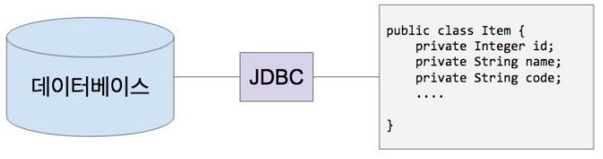
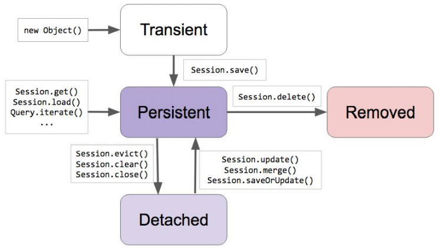

# 07. 스프링 데이터 JPA

#### 왜 JPA를 학습해야 하는가?
* 도메인 주도 개발이 가능합니다.
    * 애플리케이션의 코드가 SQL 데이터베이스 관련 코드에 잠식 당하는 것을 방지하고 도메인 기반의 프로그래밍으로 비즈니스 로직을 구현하는데 집중할 수 있습니다.
* 그리고 개발 생산성에 좋으며, 데이터베이스에 독립적인 프로그래밍이 가능하고, 타입 세이프한 쿼리 작성 그리고 Persistent Context가 제공하는 캐시 기능으로 성능 최적화까지 가능합니다.

## 1부: 핵심 개념 이해
### 관계형 데이터베이스와 자바
* JDBC
    * (관계형) 데이터베이스와 자바의 연결 고리
    
    * DataSource / DriverManager
    * Connection
    * PreparedStatement
* SQL
    * DDL : 스키마/테이블/시퀀스/인덱스 생성
    * DML : select/insert/delete/update
* 무엇이 문제인가?
    * SQL을 실행하는 비용이 비싸다.
    * SQL이 데이터베이스 마다 다르다.
    * 스키마를 바꿨더니 코드가 너무 많이 바뀌네...
    * 반복적인 코드가 너무 많아.
    * 당장은 필요가 없는데 언제 쓸 줄 모르니까 미리 다 읽어와야 하나...
* 의존성 추가
```xml
<dependency>
    <groupId>org.postgresql</groupId>
    <artifactId>postgresql</artifactId>
    <version>42.2.16</version>
</dependency>
```
* PostgreSQL 설치 및 서버 실행 (docker)
```
docker run -p 5432:5432 -e POSTGRES_PASSWORD=pass -e POSTGRES_USER=jingyu -e POSTGRES_DB=springdata --name postgres_boot -d postgres
docker exec -i -t postgres_boot bash
su - postgres
psql springdata (Window10 : psql -U jingyu springdata)

데이터베이스 조회 : \list
테이블 조회 : \dt
쿼리 : SELECT * FROM account;
```
* JDBC 연결 및 query 수행
```java
String url = "jdbc:postgresql://localhost:5432/springdata";
String username = "jingyu";
String password = "pass";

try(Connection connection = DriverManager.getConnection(url, username, password)) {
    System.out.println("Connection created: " + connection);
//            String sql = "CREATE TABLE ACCOUNT (id int, username varchar(255), password varchar(255));";
    String sql = "INSERT INTO ACCOUNT VALUES(1, 'jingyu', 'pass');";
    try(PreparedStatement statement = connection.prepareStatement(sql)) {
        statement.execute();
    }
}
```
* 결과
```
springdata=# \dt
         List of relations
 Schema |  Name   | Type  | Owner
--------+---------+-------+--------
 public | account | table | jingyu
(1 row)

springdata=# select * from account;
 id | username | password
----+----------+----------
  1 | jingyu   | pass
(1 row)
```


### ORM: Object-Relation Mapping
* JDBC 사용
```java
try(Connection connection = DriverManager.getConnection(url, username, password)) {
    System.out.println("Connection created: " + connection);
    String sql = "INSERT INTO ACCOUNT VALUES(1, 'keesun', 'pass');";
    try(PreparedStatement statement = connection.prepareStatement(sql))
    {
        statement.execute();
    }
}
```
* 도메인 모델 사용
```java
Account account = new Account(“keesun”, “pass”);
accountRepository.save(account);
```
* JDBC 대신 도메인 모델 사용하려는 이유?
    * 객체 지향 프로그래밍의 장점을 활용하기 좋으니까.
    * 각종 디자인 패턴
    * 코드 재사용
    * 비즈니스 로직 구현 및 테스트 편함
    
`ORM은 애플리케이션의 클래스와 SQL 데이터베이스의 테이블 사이의 맵핑 정보를 기술한 메타데이터를 사용하여, 자바 애플리케이션의 객체를 SQL 데이터베이스의 테이블에 자동으로 (또 깨끗하게) 영속화 해주는 기술입니다.`

| 장점 | 단점 |
|---|---|
| 생산성 : 쉽고 빠르게 매핑정보만 정의하면 데이터를 넣고뺴는게 쉬워짐.<br>유지보수성 : 코드가 간결하고 테스트도 짜기 쉬워짐. <br>성능 : 단순한 작업은 더 느릴 수 있음. but, 객체와 테이블 사이에 캐시가 존재해서 불필요한 쿼리가 수행되지 않음.<br>밴더 독립성 : DB변경에 무관. | 학습비용 : ㅎㅎㅎ |

* Q : hibernate? JPA? 뜻

### ORM: 패러다임 불일치
객체를 릴레이션에 맵핑하려니 발생하는 문제들과 해결책
* 밀도(Granularity) 문제

| 객체 | 릴레이션 |
|---|---|
| 다양한 크기의 객체를 만들 수 있음.<br>커스텀한 타입 만들기 쉬움. | 테이블<br>기본 데이터 타입 (UDT는 비추) |
 
* 서브타입(Subtype) 문제

| 객체 | 릴레이션 |
|---|---|
| 상속 구조 만들기 쉬움.<br>다형성. | 테이블 상속이라는게 없음.<br>상속 기능을 구현했다 하더라도 표준 기술이 아님.<br>다형적인 관계를 표현할 방법이 없음. |

* 식별성(Identity) 문제

| 객체 | 릴레이션 |
|---|---|
| 레퍼런스 동일성 (==)<br>인스턴스 동일성 (equals() 메소드) | 주키 (primary key) |

* 관계(Association) 문제

| 객체 | 릴레이션 |
|---|---|
| 객체 레퍼런스로 관계 표현.<br>근본적으로 ‘방향'이 존재 한다.<br>다대다 관계를 가질 수 있음 | 외래키(foreign key)로 관계 표현.<br>‘방향'이라는 의미가 없음. 그냥 Join으로 아무거나 묶을 수 있음.<br>태생적으로 다대다 관계를 못만들고, 조인테이블 또는 링크 테이블을 사용해서 두개의 1대다 관계로 풀어야 함. |

* 데이터 네비게이션(Navigation)의 문제

| 객체 | 릴레이션 |
|---|---|
| 레퍼런스를 이용해서 다른 객체로 이동 가능.<br>콜렉션을 순회할 수도 있음. | 하지만 그런 방식은 릴레이션에서 데이터를 조회하는데 있어서 매우 비효율적이다.<br>데이터베이스에 요청을 적게 할 수록 성능이 좋다. 따라서 Join을 쓴다.<br>하지만, 너무 많이 한번에 가져오려고 해도 문제다.<br>그렇다고 lazy loading을 하자니 그것도 문제다. (n+1 select) |

### JPA 프로그래밍: 프로젝트 세팅
* 데이터베이스 실행
    * PostgreSQL 도커 컨테이너 재사용
    * docker start postgres_boot
* 스프링 부트
    * 스프링 부트 v2.*
    * 스프링 프레임워크 v5.*
* 스프링 부트 스타터 JPA
    * JPA 프로그래밍에 필요한 의존성 추가
        * JPA v2.*
        * Hibernate v5.*
    * 자동 설정: HibernateJpaAutoConfiguration
        * 컨테이너가 관리하는 EntityManager (프록시) 빈 설정
        * PlatformTransactionManager 빈 설정
* JDBC 설정
    * jdbc:postgresql://localhost:5432/springdata
    * jingyu
    * pass
    
* application.properties
```properties
spring.datasource.url=jdbc:postgresql://localhost:5432/springdata
spring.datasource.username=jingyu
spring.datasource.password=pass

spring.jpa.properties.hibernate.jdbc.lob.non_contextual_creation=true
spring.jpa.hibernate.ddl-auto=create
```
* code
```java
// Entity
@Entity
@Getter
@Setter
public class Account {

    @Id @GeneratedValue
    private Long id;
    private String username;
    private String password;
}

// Runner
@Component
@Transactional
public class JpaRunner implements ApplicationRunner {

    @PersistenceContext
    EntityManager entityManager;

    @Override
    public void run(ApplicationArguments args) throws Exception {
        Account account = new Account();
        account.setUsername("jingyu");
        account.setPassword("studyhard123");

        Session session = entityManager.unwrap(Session.class);
        session.save(account);
//        entityManager.persist(account);
    }
}
```

### JPA 프로그래밍: 엔티티 맵핑
* @Entity
    * “엔티티”는 객체 세상에서 부르는 이름.
    * 보통 클래스와 같은 이름을 사용하기 때문에 값을 변경하지 않음.
    * 엔티티의 이름은 JQL에서 쓰임.
    * DB의 예약어와 같을 경우 문제가 될 수 있음.
    
* @Table
    * “릴레이션" 세상에서 부르는 이름.
    * @Entity의 이름이 기본값.
    * 테이블의 이름은 SQL에서 쓰임.
* @Id
    * 엔티티의 주키를 맵핑할 때 사용.
    * 자바의 모든 primitive 타입과 그 랩퍼 타입을 사용할 수 있음
        * Date랑 BigDecimal, BigInteger도 사용 가능.
    * 복합키를 만드는 맵핑하는 방법도 있지만 그건 논외로..
* @GeneratedValue
    * 주키의 생성 방법을 맵핑하는 애노테이션
    * 생성 전략과 생성기를 설정할 수 있다.
        * 기본 전략은 AUTO: 사용하는 DB에 따라 적절한 전략 선택
        * TABLE, SEQUENCE, IDENTITY 중 하나.
* @Column
    * unique
    * nullable
    * length
    * columnDefinition
    * ...
* @Temporal
    * 현재 JPA 2.1까지는 Date와 Calendar만 지원.
* @Transient
    * 컬럼으로 맵핑하고 싶지 않은 멤버 변수에 사용.
* application.properties
```
spring.jpa.show-sql=true
spring.jpa.properties.hibernate.format_sql=true
```

### JPA 프로그래밍: Value 타입 맵핑
* 엔티티 타입과 Value 타입 구분
    * 식별자가 있어야 하는가.
    * 독립적으로 존재해야 하는가.
* Value 타입 종류
    * 기본 타입 (String, Date, Boolean, ...)
    * Composite Value 타입
    * Collection Value 타입
        * 기본 타입의 콜렉션
        * 컴포짓 타입의 콜렉션
* Composite Value 타입 맵핑
    * @Embeddable
    * @Embedded
    * @AttributeOverrides
    * @AttributeOverride
```java
// Address
@Embeddable
public class Address {
 private String street;
 private String city;
 private String state;
 private String zipCode;
}

// Account
@Embedded
@AttributeOverrides({
@AttributeOverride(name = "street", column = @Column(name = "home_street"))})
private Address address;
```

### JPA 프로그래밍: 1대다 맵핑
* 관계에는 항상 두 엔티티가 존재 합니다.
    * 둘 중 하나는 그 관계의 주인(owning)이고
    * 다른 쪽은 종속된(non-owning) 쪽입니다.
    * 해당 관계의 반대쪽 레퍼런스를 가지고 있는 쪽이 주인.
* 단방향에서의 관계의 주인은 명확합니다.
    * 관계를 정의한 쪽이 그 관계의 주인입니다.
* 단방향 @ManyToOne
    * 기본값은 FK 생성
* 단방향 @OneToMany
    * 기본값은 조인 테이블 생성
* 양방향
    * FK 가지고 있는 쪽이 오너 따라서 기본값은 @ManyToOne 가지고 있는 쪽이 주인.
    * 주인이 아닌쪽(@OneToMany쪽)에서 mappedBy 사용해서 관계를 맺고 있는 필드를 설정해야 합니다.
* 양방향
    * @ManyToOne (이쪽이 주인)
    * @OneToMany(mappedBy)
    * 주인한테 관계를 설정해야 DB에 반영이 됩니다.

### JPA 프로그래밍: Cascade
엔티티의 상태 변화를 전파 시키는 옵션.
* 잠깐? 엔티티의 상태가 뭐지?
    * Transient: JPA가 모르는 상태
    * Persistent: JPA가 관리중인 상태 (1차 캐시, Dirty Checking, Write Behind, ...)
    * Detached: JPA가 더이상 관리하지 않는 상태.
    * Removed: JPA가 관리하긴 하지만 삭제하기로 한 상태.
    


```java
@Entity
public class Commnet {

    @Id @GeneratedValue
    private Long id;

    private String comment;

    @ManyToOne
    private Post post;
}

@Entity
public class Post {
    @Id @GeneratedValue
    private Long id;

    private String title;

    @OneToMany(mappedBy = "post", cascade = CascadeType.ALL)
    private Set<Commnet> comments = new HashSet<>();

    public void addComment(Commnet commnet) {
        this.getComments().add(commnet);
        commnet.setPost(this);
    }
}

//Runner
@Component
@Transactional
public class JpaRunner implements ApplicationRunner {

    @PersistenceContext
    EntityManager entityManager;

    @Override
    public void run(ApplicationArguments args) throws Exception {

        Post post = new Post();
        post.setTitle("Spring");

        Commnet commnet = new Commnet();
        commnet.setComment("studyhard");
        post.addComment(commnet);

        Commnet commet1 = new Commnet();
        commet1.setComment("123");
        post.addComment(commet1);

        Session session = entityManager.unwrap(Session.class);
        session.save(post);
    }
}
```
### JPA 프로그래밍: Fetch
* 연관 관계의 엔티티를 어떻게 가져올 것이냐... 지금(Eager)? 나중에(Lazy)?
    * @OneToMany의 기본값은 Lazy
    * @ManyToOne의 기본값은 Eager

### JPA 프로그래밍 7. 쿼리
* JPQL (HQL)
    * Java Persistence Query Language / Hibernate Query Language
    * 데이터베이스 테이블이 아닌 엔티티 객체 모델 기반으로 쿼리 작성
    * JPA 또는 하이버네이트가 해당 쿼리를 SQL로 변환해서 실행
    * (참고) 이 방법은 타입 세이프하지 않다
    * https://docs.jboss.org/hibernate/orm/5.2/userguide/html_single/Hibernate_User_Guide.html#hql
    * code
TypedQuery<Post> query = entityManager.createQuery("SELECT p FROM Post As p", Post.class);
List<Post> posts = query.getResultList();
* Criteria
    * 타입 세이프 쿼리
    * https://docs.jboss.org/hibernate/orm/5.2/userguide/html_single/Hibernate_User_Guide.html#criteria
    * code
CriteriaBuilder builder = entityManager.getCriteriaBuilder();
CriteriaQuery<Post> criteria = builder.createQuery(Post.class);
Root<Post> root = criteria.from(Post.class);
criteria.select(root);
List<Post> posts = entityManager.createQuery(criteria).getResultList();
* Native Query
    * SQL 쿼리 실행하기
    * https://docs.jboss.org/hibernate/orm/5.2/userguide/html_single/Hibernate_User_Guide.html#sql
    * code
List<Post> posts = entityManager
                .createNativeQuery("SELECT * FROM Post", Post.class)
                .getResultList();
 
### 스프링 데이터 JPA 원리
* JpaRepository<Entity, Id> 인터페이스
    * 매직 인터페이스
    * @Repository가 없어도 빈으로 등록
* EnableJpaRepositories
    * 매직의 시작은 여기서 부터
    * spring boot를 안썼다면 이 애노테이션을 @Configuration이 붙어있는 클래스에 추가했어야 했다. 그러나 부트가 해주고 있기 때문에 설정하지 않아도 된다
* 매직은 어떻게 이루어 지나?
    * 시작은 @Import(JpaRepositoriesRegistrar.class)
        * 이게 JpaRepository 들을 빈으로 등록해줌
    * 핵심은 ImportBeanDefinitionRegistrar 인터페이스
        * 프로그래밍을 통해 빈 생성을 할 수 있도록 해준다.
* 장점?
    * 코드의 간결함
    * 직접 작성할 test가 거의 없음
 
### 핵심 개념 마무리
* 데이터베이스와 자바
* 패러다임 불일치
* ORM이란?
* JPA 사용법 (엔티티, 밸류 타입, 관계 맵핑)
* JPA 특징 (엔티티 상태 변화, Cascade, Fetch, 1차 캐시, ...)
* 주의할 점
    * 반드시 발생하는 SQL을 확인할 것
* 팁
    * logging.level.org.hibernate.SQL=debug (spring.jpa.show-sql=true와 동일한 기능)
    * logging.level.org.hibernate.type.descriptor.sql=trace : sql을 찍었지만 ?로 값이 나오는 것을 실제 값으로 보이도록 설정

## 2부 스프링 데이터 JPA 활용

### 스프링 데이터 JPA 활용 파트 소개
* 스프링 데이터 : SQL & NoSQL 저장소 지원 프로젝트의 묶음
* 스프링 데이터 Common : 여러 저장소 지원 프로젝트의 공통 기능 제공
* 스프링 데이터 REST : 저장소 데이터를 하이퍼미디어 기반 HTTP 리소스로(REST API로) 제공하는 프로젝트
* 스프링 데이터 JPA : 스프링 데이터 Common이 제공하는 기능에 JPA 관련 기능 추가
 
### 스프링 데이터 Common 1. 리포지토리
* Spring Data Common
    * Repository
    * CrudRepository (extends Repository<T, ID>)
    * PagingAndSortingRepository (extends CrudRepository<T, ID>)
* Spring Data JPA
    * JpaRepository (extends PagingAndSortingRepository<T, ID>)
* @NoRepositoryBean
    * 중간단계의 repository를 빈으로 생성하는 것을 방지
* test
    * h2, spring boot starter test 추가
    * code
   ```java
   @RunWith(SpringRunner.class)
   @DataJpaTest
   public class PostRepositoryTest extends TestCase {
      @Autowired
      PostRepository postRepository;

      @Test
      // @DataJpaTest annotation has @Transactional.
      // Function having @Test and @Transactional annotation in spring boot test becomes rollback after test is done.
      // That's why this test doesn't send any queries. So you want to see all queries, Use @Rollback(false)
      public void crudRepository() {
         // Given
         Post post = new Post();
         post.setTitle("hello spring boot common");
         assertThat(post.getId()).isNull();

         // When
         Post newPost = postRepository.save(post);

         // Then
         assertThat(newPost.getId()).isNotNull();

         // When
         List<Post> posts = postRepository.findAll();
         assertThat(posts.size()).isEqualTo(1);
         assertThat(posts).contains(newPost);

         // When
         Page<Post> page = postRepository.findAll(PageRequest.of(0, 10));

         // Then
         assertThat(page.getTotalElements()).isEqualTo(1);
         assertThat(page.getNumber()).isEqualTo(0);
         assertThat(page.getSize()).isEqualTo(10);
         assertThat(page.getNumberOfElements()).isEqualTo(1);

         // When
         postRepository.findByTitleContains("spring", PageRequest.of(0, 10));

         // Then
         assertThat(page.getTotalElements()).isEqualTo(1);
         assertThat(page.getNumber()).isEqualTo(0);
         assertThat(page.getSize()).isEqualTo(10);
         assertThat(page.getNumberOfElements()).isEqualTo(1);

         // When
         long spring = postRepository.countByTitleContains("spring");

         // Then
         assertThat(spring).isEqualTo(1);
      }
   }
   ```
 
### 스프링 데이터 Common 2. 인터페이스 정의하기
* Repository 인터페이스로 공개할 메소드를 직접 일일이 정의하고 싶다면
* 특정 리포지토리 당
    * @RepositoryDefinition
    * code
   ```java
   @RepositoryDefinition(domainClass = Comment.class, idClass = Long.class)
   public interface CommentRepository {
      Comment save(Comment comment);
      List<Comment> findAll();
   }
   ```
* 공통 인터페이스 정의
    * 위의 기능을 다른 리포지토리에도 전부 사용할 것이라면 아래와 같이 사용할 수 있다.
    * @NoRepositoryBean
    * code
   ```java
   @NoRepositoryBean
   public interface MyRepository<T, ID extends Serializable> extends Repository<T, ID> {
      <E extends T> E save(E entity);
      List<T> findAll();
   }
   // Modify comment repository
   public interface CommentRepository extends MyRepository<Comment, Long> {
   }
   ```
### 스프링 데이터 Common 3. Null 처리
* Spring data 2.0 부터 자바 8의 Optional을 지원
    * Optional<Post> findById(Long id);
    * Optional<Post> post = findById(10L);
    * post.orElseThrow(() -> new RuntimeException("…"));
* 기본적으로 콜렉션은 Null을 리턴하지 않고 비어있는 콜렉션을 리턴합니다
* Spring framework 5.0 부터 지원하는 Null annotation지원
    * @NonNullApi, @NonNull, @Nullable
        * @Nullable Post findById(@NonNull Long id);
    * 런타임 체크 지원 함
    * JSR 305 애노테이션을 메타 애노테이션으로 가지고 있음 (IDE 및 빌드 툴 지원)
* IntelliJ 설정 (intellij에서 아직 인지를 못하는 상태)
    * Build, Execution, Deployment
        * Compiler
            * Add runtime assertion for notnull-annotated methods and parameters
            * 
    * 프로젝트 재시작 시 적용이 되고, 적용되면 파라미터에 @NonNull이 붙어있음에도 불구하고 null을 파라미터로 넘겼을 때 노란색 배경에 경고가 나오게 된다
    * 
### 스프링 데이터 Common 4. 쿼리 만들기
* 스프링 데이터 저장소의 메소드 이름으로 쿼리 만드는 방법
    * 메소드 이름을 분석해서 쿼리 만들기 (CREATE)
        * List<Comment> findByCommentContains(String keyword);
    * 미리 정의해 둔 쿼리를 찾아 사용하기 (USE_DECLARED_QUERY)
        * JPQL(default) : @Query ("SELECT c FROM comment AS c")
        * NativeQuery : @Query (value = "SELECT c FROM comment AS c", nativeQuery = true)
    * 미리 정의한 쿼리 찾아보고 없으면 만들기 (CREATE_IF_NOT_FOUND)
        * 기본 전략
* 쿼리 만드는 방법
    * 리턴 타입 {접두어}{도입부}By{프로퍼티 표현식}(조건식)[(And|Or){프로퍼티 표현식}(조건식)]{정렬 조건} (파라미터)
    * 
* 쿼리 찾는 방법
    * 메소드 이름으로 쿼리를 표현하기 힘든 경우에 사용
    * 저장소 기술에 따라 다름
    * JPA: @Query, @NamedQuery
* 쿼리를 메소드로 생성했을 때 spring data jpa가 생성할 수 없는 쿼리의 경우 빌드 중 빈 생성 시 에러가 남
 
### 스프링 데이터 Common 5. 쿼리 만들기 실습
* 기본 예제
List<Person> findByEmailAddressAndLastname(EmailAddress emailAddress, String lastname); 
// distinct
List<Person> findDistinctPeopleByLastnameOrFirstname(String lastname, String firstname); 
List<Person> findPeopleDistinctByLastnameOrFirstname(String lastname, String firstname); 
// ignoring case 
List<Person> findByLastnameIgnoreCase(String lastname);
// ignoring case
List<Person> findByLastnameAndFirstnameAllIgnoreCase(String lastname, String firstname); 
* 정렬
List<Person> findByLastnameOrderByFirstnameAsc(String lastname); List<Person> findByLastnameOrderByFirstnameDesc(String lastname); 
* 페이징
// Use PageRequest for Pageable parameter
PageRequset pageRequest = PageRequest.of(0,10,Sort.by(Sort.Direction.DESC, "likeCount"));
Page<User> findByLastname(String lastname, Pageable pageable);
Slice<User> findByLastname(String lastname, Pageable pageable); 
List<User> findByLastname(String lastname, Sort sort); 
List<User> findByLastname(String lastname, Pageable pageable); 
* 스트림
Stream<User> readAllByFirstnameNotNull();
* try-with-resource를 사용할 것. Stream을 사용한 후에는 close()해주어야 함
 
### 스프링 데이터 Common 6. 비동기 쿼리 메소드
* 비동기 쿼리
@Async Future<User> findByFirstname(String firstname);
@Async CompletableFuture<User> findByFirstname(String firstname);
@Async ListenableFuture<User> findByFirstname(String firstname);
* 해당 메소드를 스프링 TaskExecutor에 전달하여 별도의 스레드에서 실행함
* Reactive와는 다른 것
* 권장하지 않는 이유
    * 테스트 코드의 작성이 어려움
        * @Test method가 실행될 때 callback인 자식 쓰레드가 실행되기 전 부모 쓰레드가 먼저 끝나버림
    * 코드 복잡도 증가
    * 성능상 이득이 없음
        * DB부하는 결국 같고
        * 메인 쓰레드 대신 백그라운드 쓰레드가 일하는 정도의 차이
        * 단, 백그라운드로 실행하고 결과를 받을 필요는 없는 작업이라면 @Async를 사용해서 응답 속도를 향상시킬 수는 있다
 
### 스프링 데이터 Common 7. 커스텀 리포지토리 만들기
* 쿼리 메소드(쿼리 생성과 쿼리 찾아쓰기)로 해결이 되지 않는 경우 직접 코딩으로 구현 가능
    * 스프링 데이터 리포지토리 인터페이스에 기능 추가
        * code
         ```java
         public interface PostCustomRepository {
				List<Post> findMyPost();
			}
			
			@Repository
			@Transactional
			public class PostCustomRepositoryImpl implements PostCustomRepository {
			
				@Autowired
				EntityManager entityManager;
			
				@Override
				public List<Post> findMyPost() {
					System.out.println("custom findMyPost");
					return entityManager.createQuery("SELECT p FROM Post AS p", Post.class).getResultList();
				}
			}
			
			public interface PostRepository extends JpaRepository<Post, Long>, PostCustomRepository {
			}
         ```
 
* 스프링 데이터 리포지토리 기본 기능 덮어쓰기 가능
    * code
   ```java
   public interface PostCustomRepository<T> {
      List<Post> findMyPost();
      // If duplicated function exist, spring data jpa use function defined by user
      void delete(T entity);
   }

   @Override
   public void delete(Post entity) {
      System.out.println("custom delete");
      entityManager.detach(entity);
   }
   ```

* 구현 방법
    * 커스텀 리포지토리 인터페이스 정의
    * 인터페이스 구현 클래스 만들기
        * 기본 접미어를 Impl를 설정해야만 spring data jpa에서 커스텀하게 사용 가능하다
        * 이 postfix를 변경하려면 @EnableJpaRepositories(repositoryImplementationPostfix = "") 를 이용 
    * 엔티티 리포지토리에 커스텀 리포지토리 인터페이스 추가
* 기능 추가하기
* 기본 기능 덮어쓰기
* 접미어 설정하기

